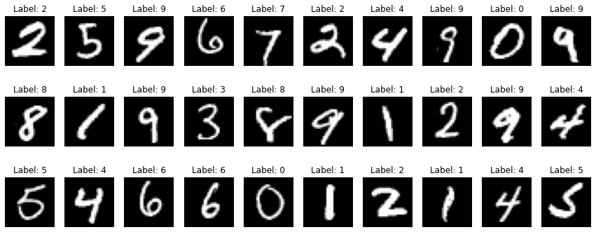
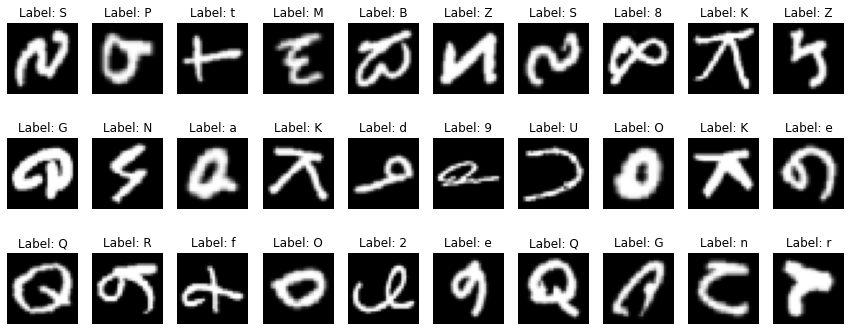
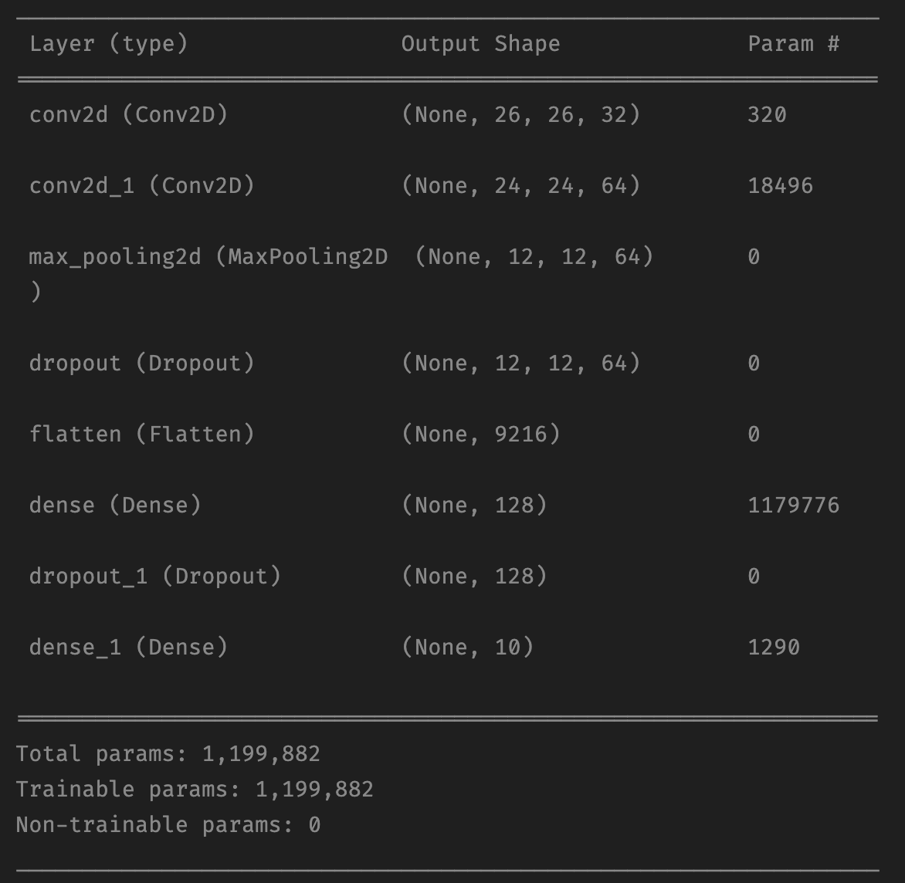
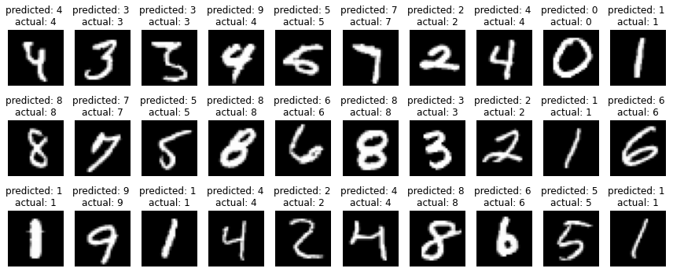
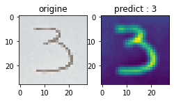
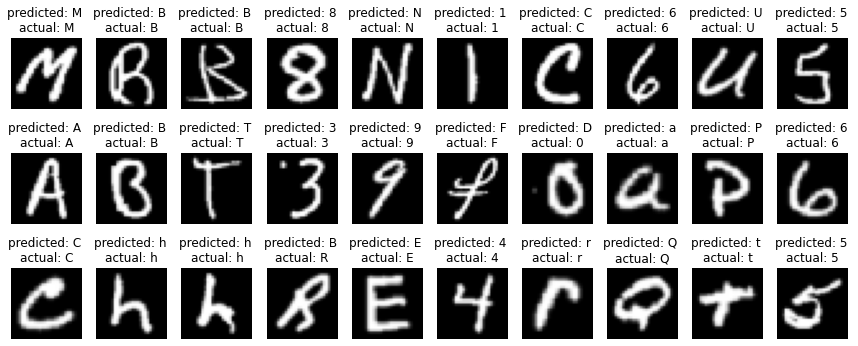
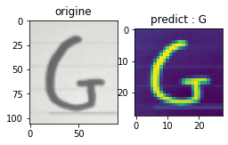
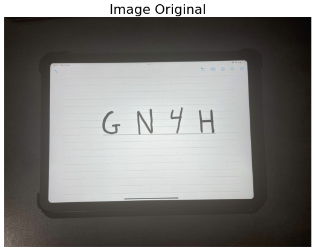
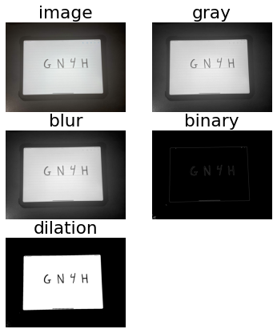
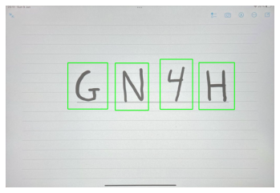

# Handwritten characters sequence recognizer

## Introduction
The goal of our project is to answer a problem, a question: **can we recognize a handwritten character sequence using machine learning? **

The detection of handwritten digits is a known problem in this field. There are several examples of this type of project, using the MNIST dataset. 

The MNIST database of handwritten digits has a training set of 60,000 examples, and a test set of 10,000 examples. The digits have been size-normalized and centered in a fixed-size image.

In our project, we want to extend this to characters (composed of digits and letters) and not only digits, and to a sequence of several characters. Our goal is to be able to recognize, for example, a phone number written on a piece of paper, or an address.
Our project mixes machine learning and image processing, in order to establish a reliable handwritten text recognition system, using another system than the classical OCR. 

### Methods used 
To do so, we will divide our project in 3 steps. Each step will have a Jupyter notebook detailing its implementation. 

1. Creation of a machine learning model for handwritten digit recognition and its training and results
2. Creation of a machine learning model for handwritten character recognition (digits + letters) and its training and results
3. Use of these models for the recognition of a sequence of characters

### Datasets used
For that, we will use 2 datesets, recovered in .csv format from the site [Kaggle.com](www.kaggle.com): 

1. The MNIST handwritten digits dataset
2. The EMNIST handwritten characters dataset (Extension of the MNSIT dataset) 

The MNIST datasets are efficient and easy to use. Each line of the csv corresponds to a 28x28 image. Each column except the first one corresponds to a pixel (pixel 0_1 pixel_0_1 ... pixel_27_27). The first column corresponds to its label, its value (for example 1, for an image corresponding to a digit 1). Its composition allows a simple interpretation by several machine learning tools, which we will detail below. This avoids large pre-processing steps. 

To retrieve them, for MNIST, several python libraries allow to obtain them directly, in particular Keras from the famous Tensorflow. However, for EMNIST, it is more complex, we must directly download the .csv from Kaggle. 

### Project rendering 
As explained above, for the rendering of the project, we will provide you with 3 notebooks for the 3 steps of the project, detailing the implementation and the explanation of each action, as well as a small demo application, allowing you to test intuitively, our models : 

1. model_CNN_digits.ipynb
2. model_CNN_characters.ipynb
3. sequence_characters_detection.ipynb

## I. Handwritten digit model creation, training and testing
This part refers to the following Jupiter Notebook: [model_CNN_digits.ipynb](https://github.com/alexisdacosta/handwritten-character-sequence-recognition/blob/master/notebooks/model_CNN_digits.ipynb)

### a. Frameworks and libraries used, and why ? 
For this part, we will use the following frameworks and libraries: 

- **sklearn**, for splitting datasets between training and testing sub datasets
- **numpy**, to perform operations on arrays and matrices
- **tensorflow**, for importing the MNIST dataset as well as the realization of machine learning and deep learning algorithms
- **matplotlib**, for displaying the dataset images
- **random**, for the generation of random numbers
- **opencv2**, for the processing of the dataset test images
  
### b. Dataset manipulation
Before implementing a machine learning algorithm, we will first perform some manipulations on our dataset. We are going to split it in two sub datasets. That will permit to evaluate the performance of our model: 

- A first part, randomly split, used to train our model, containing 60,000 images
- a second part, used for the validation and testing of our model, once trained, containing 10000 images
  
Then, we normalize our data by dividing each pixel, in gray level, by 255. 
Finally, we make sure that each image has a dimension of 28x28

### c. Model creation
#### 1. Algorithm choice 
There is a large number of models using several types of machine learning or deep learning algorithms. We have several examples of handwritten digit recognition using the SVM algorithm. 

SVM, acronym of Support Vector Machine, is a machine learning algorithm used for classification problems. It belongs to the supervised type of algorithms. Its goal, from a series of inputs, is to find a boundary between several outputs, in order to make either qualitative or quantitative predictions.

This algorithm has the virtue of being extremely simple and having many examples on the internet. We have chosen to make the task more complex, but to have more convincing results, by using a deep learning model, by implementing a CNN. 

Convolutional neural networks (CNNs) is a neural network deep learning algorithm utilized for classification and computer vision tasks. CNN uses what we call filters, which allow to realize the pattern detection. CNN do a convolution product with filters to identify patterns and features in an image. 

Convolutional neural networks have revolutionised image classification and object recognition tasks, using the principles of linear algebra, in particular the convolution product, to identify patterns and features in an image. This will be very useful, for our handwritten digits recognition.

#### 2. Algorithm implementation
For the implementation, we will use the Keras library from Tensorflow. We are going to use more particularly the Sequencial functions corresponding to the use of an ANN type model, as well as the Conv2D() functions for the realization of the convolution products, characteristic of a CNN Algorithm, as well as the MaxPool2d() functions, allowing to resample the data, Dropout(), allowing to prevent the overfitting, Flatten(), allowing to flatten the data, and Dense() allowing to define a new layer connected to the neural network 

There is our CNN model used for this case. We have found this model by trial and error : 

There is on schema witch explained who it works ? 

### d. Model training
Once this model is defined and compiled, we fit it with our training data, over 10 periods, in order to have an accuracy approaching 99%. This takes about 20 minutes.

### e. Model testing
Then, we test our model with the test sub dataset : 

We do the same with an image that we have created manually, and pre-processed with opencv : 

We notice that we have more than satisfactory results, since we have an accuracy of more than 99%: 

## II. Handwritten character model creation, training and testing
This part refers to the following Jupiter Notebook: [model_CNN_characters.ipynb](https://github.com/alexisdacosta/handwritten-character-sequence-recognition/blob/master/notebooks/model_CNN_characters.ipynb)

### a. Frameworks and libraries used, and why ? 
Same that first part

### b. Dataset manipulation
We use a different dataset. We do the same manipulation as in the first part, except that we get our datasets directly from 2 .csv files obtained from the Kaggle website. We then apply some small mathematical operations so that our model fits these data 

### c. Model creation
Same that first part

### d. Model training
Same that first part but with more epoachs (30). This takes about 30 minutes.

### e. Model testing
Then, we test our model with the test sub dataset : 

We do the same with an image that we have created manually, and pre-processed with opencv : 

We notice that we have more than satisfactory results, since we have an accuracy of more than 87%, witch is pretty good result : 

## III. Sequence character detection and recognition
This part refers to the following Jupiter Notebook: [sequence_characters_detection.ipynb](https://github.com/alexisdacosta/handwritten-character-sequence-recognition/blob/master/notebooks/sequence_characters_detection.ipynb)

### a. Frameworks and libraries used, and why ? 
For this part, we will use the following frameworks and libraries: 

- **imutils**, for image manipulation
- **numpy**, to perform operations on arrays and matrices
- **tensorflow**, for importing the MNIST dataset as well as the realization of machine learning and deep learning algorithms
- **matplotlib**, for displaying the dataset images
- **opencv2**, for the processing of the dataset test images
  
### b. Pre-processing 
For the character sequence detection, we perform a first pre-processing step. This step allows us to transform any image into an image interpretable by our model (of good size, with a good angle, of good color). For this we apply several filters on our image in order to binarize it. Then, we try to detect the presence of a sheet containing characters by removing any angle of view. Finally, we try to detect the contours of each figure present and we create for each character detected, a new image 28x28, interpretable by our model. 

### d. Model prediction
Then, we pass each image in the model to have a prediction.

### f. Results
There is an exemple for this image handwritten by us who represent 'GN4H' : 

## Conclusion 

### Results
We can see, that we have rather convincing results for the detection of numbers, and a little less convincing for letters and numbers, due to the larger number of possible label classes. The CNN model allowed us to have the best results. 
For the recognition of sequences, we used the following method : the segmentation of the image into several sub-images containing a single character. By using it, depending on the quality of the pre-processing, we obtain very good results. 

### To improve
A other methode exist. This methode is to generate a new dataset containing directly sequences, and let the CNN recognize each character by browsing the whole sub-layer. Maybe we can have better results with this method. 
